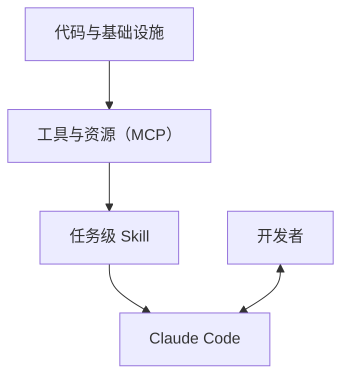

# 前言

> **这不是一本“玩 AI”的书，而是一本教你把 Claude Code 当作工程基础设施来用的书。**

过去几年里，AI 编程工具从“写几行函数的小助手”，进化成了可以读完整个代码库、批量重构、跑测试、看日志、生成文档的**工程级代理（Agent）**。  
Claude Code 正是这类工具中的代表：它并不是一个简单的聊天机器人，而是一个可以在你的项目里**持续工作**的工程伙伴。

本书的写作目的，就是回答三个问题：

- **如果我已经会写代码，还需要 Claude Code 吗？**  
- **在真实的工程环境里，我应该怎样安全、高效地使用 Claude Code？**  
- **怎样把 Claude Code 和 Skill、MCP 结合起来，变成我和团队的“可编程开发平台”？**

为了回答这三个问题，本书会从最基础的使用方式开始，一步步带你走向更高阶的工程实践。

## 本书面向谁？

本书主要面向以下几类读者：

- 已经熟悉至少一门主流编程语言（如 TypeScript、Python、Go、Java 等）的工程师；  
- 在公司或个人项目中维护真实线上系统，而不仅仅是刷题或做 Demo；  
- 正在使用或计划使用 Claude Code，希望**系统掌握工程化用法**；  
- 想要在团队内推广 AI 编程实践，却苦于缺少一套成体系的教材或规范。

如果你刚刚接触编程，或者希望从零开始学习编程语言本身，本书可能**不会**是最合适的起点；  
但如果你已经能独立完成小型/中型项目，却总觉得“时间不够用、重构来不及、测试写不完”，那么这本书就是为你准备的。

## 本书讲什么？——从 Claude Code 到 Skill 和 MCP

本书围绕三条主线展开，它们也是全书的三个关键词：

- **Claude Code**：  
  终端中的工程代理，可以读写文件、执行命令、跑测试、解析日志，是整套体系的“执行中枢”。

- **Skill**：  
  把高频任务抽象成**可复用的能力单元**。例如：  
  - “根据 git diff 生成规范的 commit message”；  
  - “分析错误日志，给出排查步骤和可能根因”；  
  - “为某个模块生成测试用例列表并补充单元测试”。  
  Skill 让 Claude Code 从“聪明的聊天对象”进化成“有明确按钮和菜单的工具箱”。

- **MCP（Model/Agent Context Protocol）**：  
  把外部世界（数据库、Issue 系统、CI、监控、知识库……）接入 Claude Code 的通用协议。  
  有了 MCP，Claude Code 不再只懂代码和文件，还能**安全地调用外部工具和数据源**。

你可以把这三者想象成一张简化的“分层示意图”：

## 如何阅读本书？

如果你是第一次系统接触 Claude Code，推荐按照以下顺序阅读：

1. **第 I 部分：Claude Code 基础与工作流**  
   了解 Claude Code 的定位、核心能力、常用模式（Ask / Plan / Agent / Debug 等），以及如何在日常开发中嵌入它。

2. **第 II 部分：Skill——把任务变成可复用的能力**  
   学会识别适合抽象为 Skill 的高频任务，设计 Skill 的输入输出，并实现第一个真正对你有帮助的 Skill。

3. **第 III 部分：MCP——连接外部世界**  
   掌握 MCP 的基本概念与实现方式，让 Claude Code 能够安全地访问日志系统、Issue 系统、监控和数据库等。

4. **第 IV 部分：项目与团队实战**  
   通过完整案例，看如何在一个具体项目和一个真实团队中，落地上述所有能力。

如果你已经在日常工作中大量使用 Claude Code，也可以带着问题**跳读某些部分**，例如：

- 想提高复用性和团队协作：优先阅读 Skill 相关章节；  
- 想把 Claude Code 接入现有平台：优先阅读 MCP 相关章节；  
- 想梳理团队规范：优先阅读团队与项目实战章节。

## 代码示例与技术栈说明

本书中的示例代码，会优先使用以下两种技术栈展示：

- **TypeScript / Node.js**：前后端皆可，生态丰富，适合演示服务端与工具链集成；  
- **Python**：在后端服务、数据工程与自动化脚本领域应用广泛。

在大多数情况下，我们会先给出**与语言无关的概念与工作流**，再在需要落地到代码时，提供 TypeScript 和/或 Python 的示例版本。  
如果你使用的是其他语言（例如 Go、Java、Rust 等），也可以将这些示例视为“伪代码”，按思路迁移到自己的技术栈中。

所有示例代码都会托管在本书配套的公开仓库中，你可以：

- 直接克隆仓库，在本地运行和修改；  
- 按章节目录查找对应示例；  
- 在阅读时配合实际代码，更直观地理解 Claude Code 的工作方式。

## 关于版本与预览版

你现在阅读的是**预览版**，这意味着：

- 内容仍在不断演进，会根据 Claude Code / Skill / MCP 的最新能力进行更新；  
- 某些章节可能以“草稿”形式出现，后续会逐步补充更多案例和插图；  
- 读者的反馈会直接影响正式出版版本的结构与重点。

为了方便引用和追踪变化，本书会在 `book.config.json` 与站点首页中标注当前版本号，例如：`0.1.0‑draft`。  
当出现重要更新（例如 Claude Code 新增关键能力，或 MCP 协议有重大变化）时，我们会：

- 更新在线版本的对应章节；  
- 在变更记录中注明此次更新涉及的章节与要点。

## 你可以从这本书中获得什么？

如果一切顺利，当你读完并实践完本书后，你应该能够：

- 为自己的项目设计一套**稳定、可复用的 Claude Code 使用方式**；  
- 用 Skill 把高频任务沉淀成团队共用的“工具按钮”；  
- 用 MCP 把现有的工程基础设施（日志、监控、Issue、CI 等）联通给 Claude Code；  
- 在团队层面制定一份可落地的《Claude Code 使用规范》。

更重要的是，你会逐渐形成一种新的思维方式：  
**遇到工程问题时，不再只想着“我怎么写代码解决”，而是会同时思考“我怎样设计一个 Skill 或 MCP，让 Claude Code 帮我和团队一起解决”。**

希望这本书能成为你在 Claude Code 时代的第一本系统实践手册，也希望你在阅读过程中，多多思考、尝试和反馈，让它变得越来越好。

