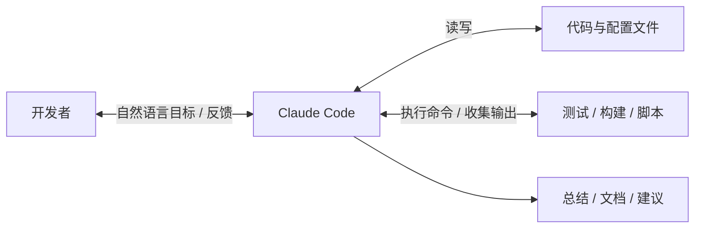
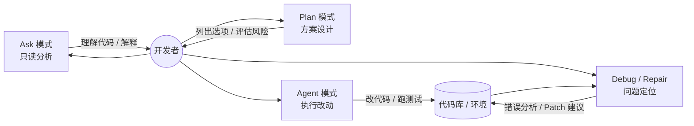
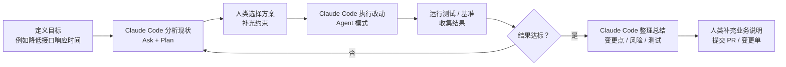

# Claude Code 概览

> **Claude Code 不是“会写代码的聊天机器人”，而是一个可以在你的项目里持续执行任务的工程代理（Agent）。**

在深入 Skill 和 MCP 之前，我们需要先回答一个基础问题：**Claude Code 到底是什么，它和你熟悉的那些“聊天式 AI”有什么不一样？**  
本章会从三个角度来介绍 Claude Code：

- 它在整个开发流程中的**定位**；  
- 它提供的几种核心**模式（Ask / Plan / Agent / Debug 等）**；  
- 它在日常工作中最常见的**使用场景与工作流**。

你可以把这一章看作是后续所有内容的“地图”。等你读完之后，再回头看 Skill 和 MCP，会更容易知道：**我到底在给谁“装能力”、加接口。**

## 1.1 Claude Code 是什么？

如果只用一句话来描述：

> **Claude Code 是运行在你工程环境中的 AI 工程助手，它可以读取代码、修改文件、执行命令，并在多轮对话中持续推进一个具体任务。**

和普通的云端聊天模型相比，Claude Code 有几个显著特点：

- **它“住”在你的项目里**：  
  它可以直接访问你的代码文件、测试脚本、配置和日志，而不是只看你复制粘贴的一小段文本。

- **它能够“动手”而不仅是“动嘴”**：  
  它不仅能给出建议，还能在经过你授权后，直接对文件进行修改、运行测试命令、收集输出并继续分析。

- **它支持多轮、长链路任务**：  
  例如：“找出导致这个接口超时的原因 → 修改代码 → 跑测试 → 根据测试结果再做一次调整”，整个过程可以在同一条“任务线程”中完成。

从形象上看，你可以把 Claude Code 想象成这样（见下图）：

## 1.2 Claude Code 与“普通聊天 AI”的关键区别

很多第一次使用 Claude Code 的同学，会有这样一种感觉：

> “好像也是在聊天窗口打字，Claude 给我一些代码和建议，和普通的 Claude / ChatGPT 有什么本质不同？”

为了回答这个问题，我们可以从下面几个维度来对比。

### 1.2.1 上下文来源：不仅是“你发来的那几段文字”

- **普通聊天模型**的上下文，大多来自你手动粘贴的内容：一两段代码、一个错误日志、一段需求描述。  
- **Claude Code** 则可以直接：
  - 读取你项目中的多个文件；  
  - 基于文件系统结构理解模块关系；  
  - 在需要时主动查找相关代码，而不是只在你贴给它的那几行里“瞎猜”。

换句话说，它看到的是**整个工程**，而不是一个个被剪切下来的小片段。

### 1.2.2 行动能力：从“给建议”到“执行操作”

普通聊天模型给出的“修改建议”，通常需要你手动复制粘贴到编辑器中，再自己调整和保存；  
Claude Code 则可以在你的确认下，直接：

- 修改一个或多个文件，并给出 diff；  
- 运行测试命令或脚本（例如 `npm test`、`pytest`、`go test`）；  
- 根据命令输出继续分析问题、调整方案。

这意味着，你可以让 Claude Code 负责更多“机械且耗时”的环节，把注意力集中在**决策和审查**上。

### 1.2.3 任务思维：从“一问一答”到“完整工作流”

普通聊天往往是“你问一句，它答一句”，每次问题都相对独立；  
而 Claude Code 被设计成可以执行**完整工作流**的代理：

- 先读代码理解现状；  
- 再提出多种可行方案，并权衡利弊；  
- 然后按选定方案逐步修改、运行验证；  
- 最后整理输出 changelog、文档或总结报告。

这种“任务导向”的思维方式，是后面 Skill 和 MCP 能够发挥威力的前提。

## 1.3 Claude Code 的核心模式：Ask、Plan、Agent、Debug……

为了更好地支持不同类型的任务，Claude Code 通常会提供多种“模式”（具体名称可能随版本略有变化，本书统一采用以下称呼）：

- **Ask 模式**：只读分析，不做修改；  
- **Plan 模式**：先问清楚，再给方案；  
- **Agent 模式**：可以读写文件、执行命令，推进复杂任务；  
- **Debug/Repair 模式**：围绕错误和失败测试进行快速定位与修复。

你可以根据当前任务的性质，选用合适的模式。

### 1.3.1 Ask：安全的“阅读与解说”模式

在 Ask 模式下，Claude Code 的职责是**理解和解释**，而不是修改。

常见用法包括：

- 让它帮你解释一段复杂的业务逻辑；  
- 让它梳理某个模块的职责和依赖关系；  
- 让它根据现有代码写出“新人入门指南”或简要文档。

因为不会改动任何文件，这个模式非常适合作为“安全的第一步”——尤其是在一个你还不熟悉的项目里。

### 1.3.2 Plan：先问清需求，再动手

Plan 模式的目标，是在真正改代码之前，先把：

- 任务目标；  
- 可选方案；  
- 潜在风险；  
- 预计影响范围；

这些内容**讨论清楚**。

例如，当你打算做一次重构时，可以用 Plan 模式让 Claude Code 先给出：

- 当前实现的优缺点；  
- 若干可行的重构方案；  
- 每种方案的工作量评估和风险点；  
- 推荐方案及其实施步骤。

等你对方案满意之后，再切换到 Agent 模式执行真正的修改。

### 1.3.3 Agent：真正“干活”的模式

Agent 模式是 Claude Code 的“工作马”。在这个模式下，它可以：

- 读取和修改多个文件；  
- 执行测试、构建或自定义脚本；  
- 根据命令输出不断调整自己的操作。

典型任务包括：

- 为某个模块补齐单元测试并确保全部通过；  
- 对某段逻辑进行重构，并更新所有受影响的调用方；  
- 根据错误日志执行一轮“定位 → 修复 → 回归测试”的完整流程。

后面我们会通过多个实战章节，展示如何安全地让 Agent 模式接管这些任务。

### 1.3.4 Debug / Repair：面向错误的快速响应

当你遇到错误堆栈、失败测试或线上告警时，可以切换到 Debug/Repair 相关模式，让 Claude Code 帮你：

- 解析错误日志，归类错误类型；  
- 提出可能的原因假设和排查步骤；  
- 生成最小修改集（patch），并指导你如何验证修复效果。

在结合 MCP 接入日志系统和监控平台之后，这一类模式会更加强大——它可以直接从外部系统读取数据，而不再需要你手动复制粘贴。

## 1.4 一个典型的 Claude Code 工作流长什么样？

为了更直观地理解 Claude Code 在日常开发中的角色，我们来看一个简化的工作流示意（见下方流程图）：

1. **确认目标（人）**  
   你通过自然语言描述想完成的事情，例如：“把这个接口的平均响应时间从 800ms 降到 300ms 左右”。

2. **分析现状（Claude Code / Ask + Plan）**  
   Claude Code 阅读相关代码和配置，分析当前实现，列出可能的性能瓶颈，并给出若干优化方案。

3. **选择方案（人）**  
   你根据业务理解和风险评估，选择其中一到两个方案，并补充必要的约束条件。

4. **实施与验证（Claude Code / Agent）**  
   Claude Code 按方案修改代码、运行测试或基准脚本，并根据结果进行微调。

5. **总结与交付（Claude Code + 人）**  
   Claude Code 帮你整理这次优化的变更点、风险提示和测试结果；  
   你在此基础上补充业务说明和后续计划，形成最终的 PR 描述或技术说明。

在这个过程中，人和 Claude Code 的分工大致是：

- 人：负责目标定义、方案选择、风险把控、最终决策；  
- Claude Code：负责信息收集、方案生成、具体改动和验证步骤的执行。

## 1.5 小结：把 Claude Code 放在正确的位置上

在这一章里，我们没有急着讨论具体命令和配置，而是重点回答了三个更基础的问题：

- Claude Code 是什么，它和普通聊天模型有什么不同；  
- 它有哪些核心模式，每种模式适合做什么；  
- 在一个简单但完整的工作流中，人和 Claude Code 应该如何分工。

在后续章节中，我们会逐步缩小镜头，深入到更具体的场景中：  
先是如何用 Claude Code 读懂代码、重构和调试；  
然后是如何用 Skill 把这些能力固化下来；  
最后是如何用 MCP 把外部系统接入这个“工程大脑”。

在继续阅读之前，你可以先在自己的项目里思考一个问题：  
**如果今天只能让 Claude Code 帮你做一件事，那会是什么？**  
带着这个问题进入下一章，你会更容易把书中的内容和自己的实际需求对应起来。

