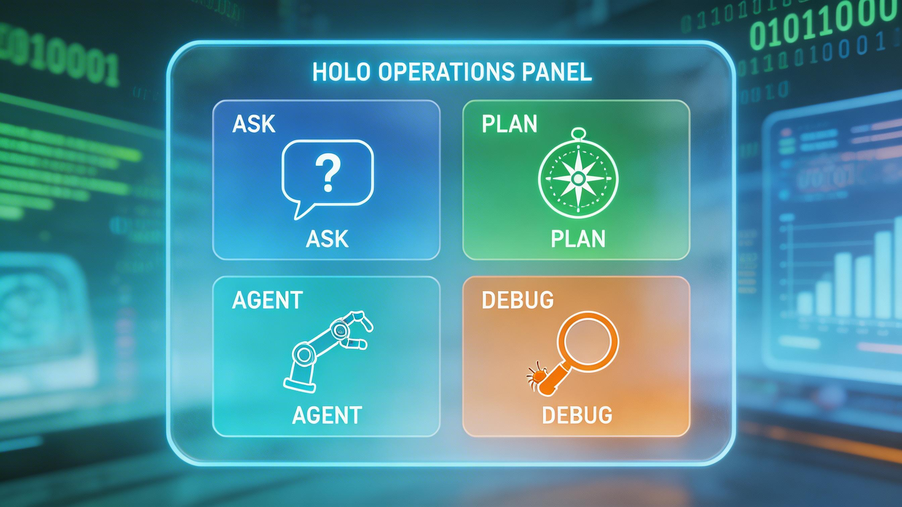

# 第 2 章　Claude Code 的模式体系



在上一章中，我们提到 Claude Code 不是一个简单的聊天机器人，而是一个多面手的工程代理。为了适应不同的工作场景——有时你需要它大胆修改代码，有时你只需要它静静地解释逻辑——Claude Code 设计了一套清晰的**模式（Modes）体系**。

本章将深入剖析这四种核心模式：**Ask（问询）**、**Plan（规划）**、**Agent（执行）** 和 **Debug（调试）**。掌握它们，你就能在“思考”与“行动”之间自由切换，既保证工程安全，又最大化开发效率。

## 2.1 模式总览：什么时候用什么？

在开始具体介绍之前，我们先看一张决策表，帮助你快速建立直觉：

| 模式 | 核心动作 | 是否修改代码 | 典型场景 | 对应命令/指令 |
| :--- | :--- | :--- | :--- | :--- |
| **Ask** | **只读分析** | ❌ 否 | 阅读代码、解释逻辑、回答架构问题、生成文档 | `claude ask "..."` 或在对话中要求“只解释” |
| **Plan** | **思考与规划** | ❌ 否 (只输出计划) | 复杂重构前、需求不明确时、需要评估风险时 | `claude plan "..."` |
| **Agent** | **读写执行** | ✅ 是 | 实现功能、修改 Bug、重构代码、运行测试 | 直接输入指令，或 `claude "..."` (默认) |
| **Debug** | **诊断与修复** | ✅ 是 (修复阶段) | 测试失败、报错排查、环境配置问题 | `claude debug` 或传入错误日志 |

你可以把这四种模式想象成一个工程师的四种“精神状态”：
- **Ask** 是他在**阅读文档**；
- **Plan** 是他在**白板前设计方案**；
- **Agent** 是他在**IDE 里疯狂敲代码**；
- **Debug** 是他在**盯着日志抓头发**。

---

## 2.2 Ask 模式：安全的“阅读与解说”

Ask 模式是 Claude Code 最“安全”的模式。在这个模式下，Claude Code 就像一个拥有只读权限的高级顾问。

### 2.2.1 核心能力
- **全库搜索与理解**：它可以遍历整个代码库，理解文件结构和依赖关系。
- **解释复杂逻辑**：针对晦涩的算法或遗留代码，生成人类可读的解释。
- **文档生成**：根据代码自动生成 README、接口文档或注释。

### 2.2.2 典型使用场景

**场景一：接手陌生项目**
当你刚克隆一个新的仓库，不知道从何下手时：
```bash
$ claude ask "请解释这个项目的核心架构，以及主要模块之间的依赖关系"
```
Claude 会扫描文件结构，通过 `package.json`、`requirements.txt` 或目录命名推断架构，并给出阅读建议。

**场景二：理解晦涩代码**
遇到一段写满“魔法数字”的函数：
```bash
$ claude ask "分析 src/utils/calc.ts 中的 calculateTax 函数，解释它的计算逻辑"
```

**场景三：询问工程规范**
```bash
$ claude ask "当前项目中是如何处理日志记录的？有没有统一的 Logger 封装？"
```

### 2.2.3 最佳实践
- **多问“为什么”**：不仅问代码“是什么”，还要问“为什么要这样写”，Claude 往往能通过上下文推断出设计意图。
- **指定输出格式**：可以明确要求它输出 Mermaid 流程图、列表或 Markdown 表格，便于你复制到文档中。

---

## 2.3 Plan 模式：先问清，再动手

很多开发者（以及 AI）容易犯的一个错误是：**拿到需求就急着改代码，结果改错地方或引入新 Bug**。Plan 模式就是为了解决这个问题而生的。

### 2.3.1 核心流程
Plan 模式不会直接执行修改，而是会输出一份**结构化的实施计划**。通常包含：
1.  **目标确认**：它理解的需求是什么。
2.  **现状分析**：当前代码是怎样的，哪些文件会被触及。
3.  **方案选项**：通常提供 A/B 两种方案（例如“激进重构”vs“保守修补”）。
4.  **风险评估**：可能会破坏哪些现有功能。
5.  **分步计划**：具体的执行步骤（Step 1, Step 2...）。

### 2.3.2 典型使用场景

**场景一：大型重构**
你想把一个巨型组件拆分成小的子组件：
```bash
$ claude plan "将 UserProfile.vue 拆分为 Header, BasicInfo, 和 Settings 三个子组件"
```
Claude 会列出拆分步骤，提醒你注意共享状态（Props/Events）的传递，并让你确认拆分边界。

**场景二：引入新依赖**
```bash
$ claude plan "引入 TanStack Query 替换现有的 axios 手动请求"
```
它会评估工作量，提醒你需要修改多少个文件，以及如何处理错误处理逻辑的迁移。

### 2.3.3 为什么即使是小任务也推荐用 Plan？
即便是“修改一个字段名”这样的小任务，使用 Plan 模式也能让你**二次确认**影响范围。很多时候，Claude 在 Plan 阶段会发现：“哎，这个字段在数据库 Schema 里也用到了，需要同步修改迁移脚本。”——这种洞察能帮你省下几个小时的排错时间。

---

## 2.4 Agent 模式：真正干活的工作马

这是 Claude Code 的默认模式，也是它最强大的形态。Agent 模式结合了“思考”与“行动”，是一个完整的自主循环。

### 2.4.1 工作循环 (The Loop)
当你给出一个指令（如“实现登录页面”）时，Agent 模式会进入以下循环：
1.  **Search & Read**：搜索相关文件，读取上下文。
2.  **Think**：思考修改方案（在内部进行微型 Plan）。
3.  **Act**：调用工具进行文件编辑、创建或删除。
4.  **Verify**：(如果配置了) 运行 linter 或测试命令。
5.  **Iterate**：如果遇到错误，自动根据错误信息调整代码，直到成功或达到重试上限。

### 2.4.2 权限与安全
虽然 Agent 模式很强大，但它绝不是“脱缰野马”。Claude Code 内置了严格的**人机确认机制**（Human-in-the-loop）：
- **敏感操作需批准**：删除文件、大规模修改、执行 shell 命令（特别是涉及网络或系统配置的命令）通常需要你按 `y` 确认。
- **Diff 预览**：在写入文件前，它会展示 diff 供你审查。

### 2.4.3 典型使用场景
- **功能开发**：“创建一个新的 API 接口 `/api/v1/users`，支持分页查询。”
- **测试补充**：“为 `src/utils` 目录下的所有工具函数补充单元测试，覆盖率要求 80% 以上。”
- **批量修改**：“把所有用到 `var` 的地方改为 `const` 或 `let`。”

---

## 2.5 Debug / Repair 模式：围绕错误的快速响应

开发中最令人头秃的时刻莫过于：测试红了一片，或者控制台疯狂报错。Debug 模式（有时也称为 Repair 模式或工作流）是专门为此设计的急救包。

### 2.5.1 核心能力
- **日志分析**：它可以直接读取终端输出的错误堆栈，解析文件路径和行号。
- **测试驱动修复**：它可以反复运行失败的测试命令，每次修改后自动验证，直到测试通过。
- **根因定位**：它不仅修复表面错误，还会尝试查找导致错误的根本原因（例如配置错误、依赖冲突）。

### 2.5.2 典型使用场景

**场景一：测试挂了**
你刚跑完 `npm test`，发现有 3 个测试失败。
```bash
$ claude debug
```
或者直接把错误日志粘贴给它。Claude 会分析失败原因，定位到具体代码行，并提出修复补丁。

**场景二：启动报错**
项目启动不起来，报错 `Module not found`。
Claude Code 可以检查 `node_modules`、`package.json` 和文件路径，帮你找出是没安装依赖，还是导入路径写错了。

### 2.5.3 最佳实践：提供尽可能多的上下文
在 Debug 模式下，信息的完整性至关重要。
- 如果是运行时错误，尽量提供完整的堆栈跟踪。
- 如果是逻辑错误，描述清楚“预期的行为”和“实际的行为”。
- 告诉 Claude 你最近修改了什么（或者让它自己看 `git diff`），因为 Bug 往往就藏在最近的变动里。

---

## 2.6 小结

- **Ask** 用于**懂**：阅读、解释、文档。
- **Plan** 用于**想**：架构、重构、风险评估。
- **Agent** 用于**做**：编码、测试、重构。
- **Debug** 用于**修**：排错、修复测试。

熟练的 Claude Code 用户，往往会像这样组合使用：
> “先用 **Ask** 搞懂现有逻辑，再用 **Plan** 制定重构方案，确认无误后让 **Agent** 执行修改，最后如果遇到边缘情况报错，用 **Debug** 快速收尾。”

下一章，我们将把这些模式串联起来，看看在真实的日常工作流中，它们是如何协同工作的。
