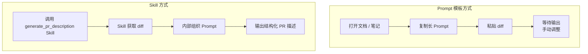
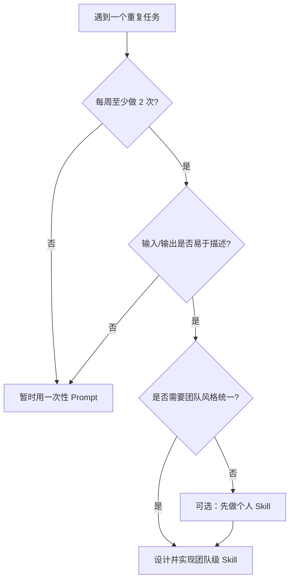

# Skill 入门：把 Claude Code 变成你的可编程工具箱


## 5.1 为什么只靠临时 Prompt 不够用了？

在前几章中，你已经看到，Claude Code 可以帮我们做很多事情：阅读陌生代码库、生成测试、分析日志、写重构方案……但如果仔细回想，你会发现一个共同点——每当我们要做这些事，往往都要**重新编写一段类似的提示词**，或者从历史对话里翻出一段旧 Prompt 再改一改。这种方式有几个明显的痛点：

- 每个人写 Prompt 的习惯不同，输出质量和风格难以统一；
- 高频重复的任务（例如生成 commit message、PR 描述、接口文档），每次都要重新“讲一遍规则”；
- 团队内部很难共享最佳实践，新人也不知道“哪段 Prompt 是目前公认最好用的版本”。

**Skill** 这一章节要解决的，正是以上问题。它要回答的是：

- 如何把高频、可抽象的任务，变成一个**可以被反复调用的“工具”**，而不是一次性的对话？  
- 如何让 Claude Code 在你的项目里拥有一套**固定的能力清单**，而不是一堆散落在聊天记录里的 Prompt？  
- 如何让团队在 Skill 层面达成共识：大家都用同一套“生成 commit message”“生成 PR 描述”“分析错误日志”的套路？

你可以把本章理解为：**从“会用 Claude Code”到“会给 Claude Code 安装工具”的第一步**。等你读完并实践完本章的内容，你至少应该具备以下能力：

- 能用自己的语言，向同事解释什么是 Skill，它和普通 Prompt 有什么本质区别；
- 能为一个具体任务（例如“根据 diff 生成规范 commit message”）设计出合理的 Skill 接口；
- 能实现一个最小可用的 Skill，并在日常开发中稳定复用；
- 能根据失败案例迭代 Skill，让它越来越贴合你和你团队的实际需求。

从本章开始，Claude Code 在你心目中的形象，会从“一个聪明的助手”，慢慢变成“**可以被你编程和扩展的工程平台**”。Skill 是这个平台上最重要的组成部分之一。

## 5.2 用直觉类比理解 Skill：它不是“更长的 Prompt”

在正式给出定义之前，我们先用几个直观的比喻，帮你建立对 Skill 的感觉。

很多人第一次听到 Skill，会本能地以为：

> “哦，Skill 不就是一段写得更长、更复杂的 Prompt 吗？”

如果你也有这样的直觉，这一节的目标就是：**温和但坚决地帮你纠正这个印象**。

### 5.2.1 从 Prompt 模板到 Skill

先看最常见的一种做法：**Prompt 模板**。

假设你已经总结出了一段比较好用的提示词，用来生成 commit message。你可能会把它贴在一个笔记软件里，或者存在某个 `prompts.md` 文件里，每次需要用的时候：

1. 打开文件或笔记；
2. 复制整段 Prompt；
3. 粘贴到对话框里；
4. 再把本次的 diff 粘进去；
5. 按发送，等待结果。

这种“Prompt 模板”的做法，本质上仍然是**一次性对话**：Claude Code 不知道你在做的是“生成 commit message”这种任务，它只知道——你又丢给它了一段很长的文字说明。

而 Skill 想要达成的是另一件事：  
你希望以后可以**直接说出任务的名字和参数**，而不再关心内部是怎样组织 Prompt 的。例如：

- “调用 `generate_commit_message` 这个 Skill，输入是当前分支的 diff”；
- “调用 `analyze_error_log` 这个 Skill，输入是一段最近的错误日志”。

从这个角度看，**Skill 更像是一个“带名字的任务接口”，而不是一段 Prompt 文本**。Prompt 只是 Skill 内部实现的一部分，就像函数体里的代码一样，而不是函数本身。

### 5.2.2 一个具体例子：PR 描述生成

我们用一个更具体的例子来比较“Prompt 模板”和“Skill”的差异（如下方示意图所示）。

假设你想让 Claude Code 帮你写 Pull Request 描述。



- **Prompt 模板方式**：  
  - 你在某处保存这样一段文字：“你是一个资深工程师，请根据下面的 git diff 生成一份符合 XX 团队规范的 PR 描述……（后面很长的一段规则）”；  
  - 每次写 PR 时，你复制这段文字 + 粘贴 diff，然后等待输出。

- **Skill 方式**（从使用者视角）：  
  - 你只需要告诉 Claude Code：  
    - “调用 `generate_pr_description` Skill，输入是当前分支相对于 `main` 的 diff”；  
  - Skill 自己负责：  
    - 如何获取 diff；  
    - 如何组织 Prompt；  
    - 如何把输出格式化成你喜欢的结构（标题、小结、测试说明、风险评估等）。

在 Prompt 模板方式下，**任务的“名字”和“用法”是靠人记住的**；  
在 Skill 方式下，**任务变成了 Claude Code 已经“装好”的一个能力**，可以被程序化地调用，也可以被团队其他人共享。

### 5.2.3 什么时候不需要 Skill

当然，并不是所有任务都值得做成 Skill。  
有两类场景，用一次性 Prompt 反而更合适：

- **高度创意、极度依赖当下上下文的任务**  
  例如给新产品起名字、脑暴活动文案，这类任务的输入和输出形式变化极大，很难提前定义成固定接口。

- **偶发的一次性需求**  
  比如临时让 Claude 帮你解释某一段特别怪的正则表达式，这种事情不太可能频繁发生，也就没有必要为它专门设计一个 Skill。

本章剩下的内容，会聚焦在那一类**“高频、结构稳定、对团队风格有要求”的任务**。对于这些任务，把它们抽象成 Skill，往往会给你带来远超预期的收益。

## 5.3 Skill 的核心概念与结构

上一节更多是“感觉上的区别”，这一节开始，我们用更工程化的方式来刻画 Skill：  
**从接口、位置和生命周期三个角度，给 Skill 一个可以在团队内讨论的共同语言。**

### 5.3.1 Skill 的“接口视角”

从接口的角度看，Skill 很像一个“远程函数”：

- 有一个稳定的**名字**（`name`）；  
- 有一组**输入参数**（`inputs`）；  
- 有一个约定好的**输出结构**（`outputs`）；  
- 还有一段**自然语言描述**，说明如何在什么场景下使用它。

我们可以用接近 JSON 的方式来表达一个 Skill 的“接口定义”：

```json
{
  "name": "generate_commit_message",
  "description": "根据 git diff 生成符合团队规范的 commit message",
  "inputs": {
    "diff": "string"
  },
  "outputs": {
    "title": "string",
    "body": "string"
  }
}
```

在真实实现中，字段名和格式会略有不同，但这个抽象足以支撑团队协作：  
**大家讨论的不是 Prompt 本身，而是这段结构化“接口定义”。**

### 5.3.2 Skill 在 Claude Code 体系中的位置

回忆一下在前言里的那张总结构图：代码与基础设施在最底层，MCP 工具在中间，Skill 再往上一层，人和 Claude Code 在最上层协作。

换一种更工程的说法：

- **Claude Code** 是执行引擎和通用大脑；  
- **MCP** 把外部系统和工具封装成“可调用能力”；  
- **Skill** 则是把这些能力按任务场景重新编排，形成**上层业务逻辑**。

用 mermaid 来画就是这样：


在这个图里，Skill 并不直接操作文件系统或外部 API，而是通过 Claude Code 和 MCP 这两层去完成工作；  
这让 Skill 本身可以保持“轻”和“可移植”：你可以在不同项目间复用同一个 Skill，只需要在底层换掉 MCP 和代码仓库即可。

### 5.3.3 Skill 的生命周期：从想法到团队资产

一个成熟的 Skill，往往会经历这样的生命周期：

1. **发现阶段**：  
   - 你在工作中发现某个任务反复出现，例如“写 PR 描述”“补单测”“解读某类日志”。  
   - 注意到：每次做这件事时，你的 Prompt 基本类似，只是替换了输入内容。

2. **设计阶段**：  
   - 用前一小节的方式，给它起一个清晰的名字，想清楚输入 / 输出结构。  
   - 和同事沟通：这个 Skill 需要满足哪些规范？有没有团队偏好的格式？

3. **实现阶段**：  
   - 在本书后续章节介绍的机制下，把接口定义落地为真正可调用的 Skill。  
   - 在实现内部整理 Prompt 模板、调用步骤和错误处理逻辑。

4. **使用阶段**：  
   - 自己先在日常工作中大量使用，观察成功和失败的案例。  
   - 邀请同事一起用，收集他们的体验反馈。

5. **迭代与固化阶段**：  
   - 根据失败样本和反馈，不断改进 Skill 的 Prompt 与逻辑。  
   - 当稳定下来后，把 Skill 文档化、纳入团队开发规范，成为真正的“工程资产”。

你可以在自己的项目里画一条类似的生命周期图，列出当前有哪些任务已经处在“可以设计成 Skill”的阶段。

## 5.4 编写你的第一个 Skill：统一生成 Commit Message

这一节我们用一个非常具体、又足够常见的例子——**统一生成 commit message**——带你从零走完一个 Skill 的创建流程。  
目标是：在读完这一节并完成练习后，你能在自己的项目里实现一个可用的 `generate_commit_message` Skill。

### 5.4.1 场景设定：commit message 杂乱无章

先回想一下你或你团队的实际情况：

- 有人只会写“fix bug”“update”，几乎看不出改了什么；  
- 有人写中文，有人写英文；  
- 有人会认真列出变更点，但格式各不相同；  
- 回顾历史提交、排查问题时，很难从 commit message 本身获取足够信息。

如果你想在团队里推进更规范的提交信息格式，例如：

- 标题使用固定前缀（`feat:`, `fix:`, `docs:`...）；  
- 正文列出本次变更的动机、主要改动点和潜在风险；  
- 需要在正文末尾附上关联 Issue 或任务编号；

那你会发现，**单靠大家“自觉记住规范”几乎不可能长期维持**。  
这正是 Skill 可以大显身手的地方：让**机器来记规范，人类专注写代码和做决策**。

### 5.4.2 设计 Skill：从需求到接口

根据上述场景，我们可以归纳出这个 Skill 的需求：

- **输入**：  
  - 一段 git diff，或者对本次改动的简要说明。  
  - 可选：本次变更的类型（`feat`/`fix`/`refactor` 等）。

- **输出**：  
  - 一行符合团队规范的标题（例如 `feat: 支持导出报表为 CSV`）；  
  - 若干行正文，包含：  
    - 动机 / 背景；  
    - 主要变更点列表；  
    - 潜在风险或注意事项；  
    - 可选：关联的 Issue/任务编号占位。

用接口的形式描述，就是这样：

```json
{
  "name": "generate_commit_message",
  "description": "根据当前 git diff 生成符合团队规范的 commit message",
  "inputs": {
    "diff": "string",
    "type": "string (可选，默认 auto，常见值 feat/fix/refactor/docs/chore)"
  },
  "outputs": {
    "title": "string",
    "body": "string"
  }
}
```

此时你可以停下来，拿一张纸或一个 Markdown 文件，把你所在团队**真实的 commit 规范**也补充进去：  
标题长度限制、是否允许 Emoji、正文是否必须包含“测试说明”等，这些内容稍后会被我们写进 Skill 的内部 Prompt 中。

### 5.4.3 实现 Skill：最小可用版本的 Prompt 草稿

在本章中，我们暂时不深入 Skill 的具体配置文件和运行机制（后续章节会详细讲），  
这里只关心：**如果你是 Claude Code，要根据 diff 和类型生成一个 commit message，你希望自己被怎样指挥？**

可以先写出一个“内部 Prompt 草稿”，例如（简化版）：

```text
你是负责代码评审和变更记录的资深工程师。

【团队规范】
- 使用英文类型前缀：feat, fix, refactor, docs, chore。
- 标题使用 50 个字符以内的简短句子，首字母小写，不以句号结尾。
- 正文使用中文，包含：变更动机、主要改动点（使用列表）、潜在风险或注意事项。

【本次变更类型】
{{type}}

【本次变更 diff】
{{diff}}

【输出格式】
第一行：<type>: <summary>
空一行
后续多行：正文内容
```

注意几点：

- Prompt 中把“团队规范”“本次变更”“输出格式”明显分段，便于后续维护；  
- 使用占位符 `{{type}}` 和 `{{diff}}`，方便在 Skill 中替换为真实内容；  
- 明确要求标题和正文风格，减少风格漂移。

在真正实现 Skill 时，你只需要把这段 Prompt 挪到配置/代码里，用你喜欢的模板引擎或字符串替换方式填充变量即可。

### 5.4.4 调用与体验：从一次性 Prompt 到“一键命令”

当这个 Skill 可以被 Claude Code 调用之后，理想体验应该是这样的流程：

1. 你在本地改完代码，执行完测试；  
2. 在终端里运行某个命令，或者在 Claude Code 中说：  
   - “请调用 `generate_commit_message` Skill，基于当前工作区的 diff 生成提交信息”；  
3. Claude Code 读取 diff，调用 Skill，返回类似：

```text
feat: 支持导出报表为 CSV

- 新增报表导出服务与对应 API
- 在前端报表页面增加“导出为 CSV”按钮
- 为导出逻辑补充单元测试与集成测试

风险与注意事项：
- 导出接口的执行时间与数据量相关，对超大报表建议配合异步任务队列
```

4. 你只需要检查是否符合预期，稍作修改后复制到 `git commit` 即可。

从此之后，每当你或团队成员要提交代码时，只要记住一句话：  
**“让 Claude Code 帮我调用 `generate_commit_message`”**，就能得到结构统一的提交信息。

### 5.4.5 思考与扩展

在最小可用版本跑通之后，你可以考虑逐步扩展这个 Skill：

- 支持更多类型前缀：`perf`, `test`, `build`, `ci` 等；  
- 根据 diff 的大小自动调整正文粒度：改动少时只写一句话，改动多时列出更多细节；  
- 自动提取或提醒补充关联的 Issue/任务编号；  
- 提供“精简模式”和“详细模式”，供不同场景使用。

这些扩展可以留在你真正落地 Skill 时慢慢尝试，不必一口气做完。  
关键是：**先让这个 Skill 成功“替代人工记规范”这件事**。

## 5.5 Skill 的调试与演进：从“能用”到“好用”

现实中，第一次实现出来的 Skill 往往只处在“能用”的阶段：  
大多数时候输出还不错，但偶尔会出现风格跑偏、内容缺失或者完全误解的情况。  
这一节关注的问题是：**如何系统地调试和演进一个 Skill，让它逐渐变成你真正信赖的“惯用工具”？**

### 5.5.1 Skill 常见“翻车”场景

你可以边读边回想自己使用 AI 时遇到过的类似情况：

- 同一个 Skill，对不同人、不同时间给出的风格差异很大；  
- 对简单 diff 的表现很好，对长 diff 则显得混乱；  
- 当输入缺失某些关键上下文时，Skill 沉默地给出貌似合理但实际上错误的结果。

这些问题的根源往往在于：

- Prompt 中**约束不够清晰**，导致模型有太大自由度；  
- **输入不完备**，Skill 只能凭猜测补齐缺失信息；  
- **缺乏系统性的失败样本收集**，每次遇到问题都是“当场修当场改”，没有沉淀。

### 5.5.2 用“失败样本”驱动迭代

给 Skill 做迭代时，一个简单但非常有效的方法是：**刻意收集失败样本**。

最小实践步骤可以是：

1. 在仓库里为每个重要 Skill 建一个专门的目录，例如 `skill-notes/generate_commit_message/`；  
2. 每次发现输出明显不符合预期时，把：  
   - 输入（diff / 参数）；  
   - 得到的输出；  
   - 你理想中的输出；  
   以 Markdown 形式记录下来；
3. 每隔一段时间（如一两周），集中回顾这些失败样本，观察是否有共性：
   - 是不是某类 diff 一直表现不好？  
   - 是不是某类风险提示总是漏掉？  
   - 是不是在某种语言（中文/英文）下风格不稳定？

然后针对这些共性，回到 Skill 的 Prompt 与逻辑中，**有针对性地增加约束或补充输入**。  
改完之后，再用这些失败样本回放一遍，看是否得到明显改进。

### 5.5.3 版本化与回滚

既然 Skill 是“工程资产”，那它天然也应该被纳入版本控制。  
一个实用的做法是：

- 把 Skill 的定义与实现文件放在仓库中，和业务代码一起用 git 管理；  
- 对每一次显著修改（尤其是 Prompt 改动）写一条简单的变更说明；  
- 为关键版本打上 tag，例如 `skill-generate-commit-message-v1.0`。

这样做的好处是：

- 当某次改动导致 Skill 效果明显变差时，可以**快速回滚**到上一个稳定版本；  
- 通过 git 历史，你能清楚看到这个 Skill 是如何随着团队实践逐步演进的。

## 5.6 什么时候该做成 Skill，什么时候只用 Prompt？

到这里，你已经看到 Skill 的威力，也亲手设计并实现了一个简单的 Skill。  
接下来一个现实的问题是：**不是所有事情都值得做成 Skill，怎么判断？**

### 5.6.1 适合抽象成 Skill 的任务特征

可以用一个“三问法”做快速评估：

1. **这件事是否高频？**  
   - 每周都要做好几次，或每个迭代都要用到；
2. **这件事的输入输出是否相对稳定？**  
   - 即便内容不同，但结构相似，可以用几个参数描述清楚；
3. **这件事是否需要团队风格统一？**  
   - 如果每个人自己写，结果差异很大，影响协作效率。

只要满足其中两条，就非常值得考虑做成 Skill。  
例如：

- 生成 PR 描述；  
- 生成/补充单元测试；  
- 分析某类错误日志并给出排查步骤；  
- 根据需求文档生成接口设计草稿。

### 5.6.2 不适合做成 Skill 的任务

相反，以下场景通常不适合作为 Skill 的首选：

- **高度创意/一次性任务**：  
  例如为新产品起名字、写营销文案、做自由脑暴，这类任务的输入输出极难结构化，更适合开放式对话。

- **需求尚未稳定的探索性流程**：  
  比如你刚开始尝试一套新的代码评审流程，每一次的做法都在剧烈变化，这时先记录经验、让流程稳定下来，再考虑固化成 Skill 会更合理。

### 5.6.3 一个简单的决策流程图



你可以把这张图贴在团队的内部文档里，作为大家讨论“要不要为某个任务做 Skill”的共同依据。

## 5.7 小结与练习

这一章，我们完成了从直觉到工程化的过渡：

- 从“Prompt 模板”出发，理解了 Skill 作为“带名字和参数的任务接口”的本质；  
- 从接口、位置和生命周期三个角度，勾勒出 Skill 在 Claude Code 体系中的角色；  
- 通过“统一生成 commit message”的案例，走完了一个完整的 Skill 设计与实现过程；  
- 讨论了如何调试与演进 Skill，以及在哪些场景下更适合继续使用一次性 Prompt。

接下来更重要的是**练习和内化**。试着完成以下练习题，把本章内容真正变成自己的工具：

1. **练习 1：为“生成 PR 描述”设计 Skill 接口**  
   - 写出 `name`、`description`、`inputs`、`outputs`；  
   - 用自然语言描述内部 Prompt 的三个主要部分。

2. **练习 2：列出你项目中最适合做成 Skill 的 3 个任务**  
   - 对每个任务回答“三问法”：高频度、输入输出结构、团队统一需求；  
   - 初步起一个 Skill 名字，并写下 1–2 句说明。

3. **练习 3：为 `generate_commit_message` Skill 设计一次迭代**  
   - 想象一个它“翻车”的具体场景，写出失败样本；  
   - 根据这个样本，修改或补充一条 Prompt 约束；  
   - 描述你期待修改后的输出会有哪些改善。

在下一章中，我们会在这些入门知识的基础上，进一步讨论**如何组织和管理一整套 Skill 体系**，以及如何让 Skill 在团队内部真正“活起来”。到那时，你会发现：本章这个看似简单的 commit message Skill，其实已经包含了所有关键的设计要素。 

