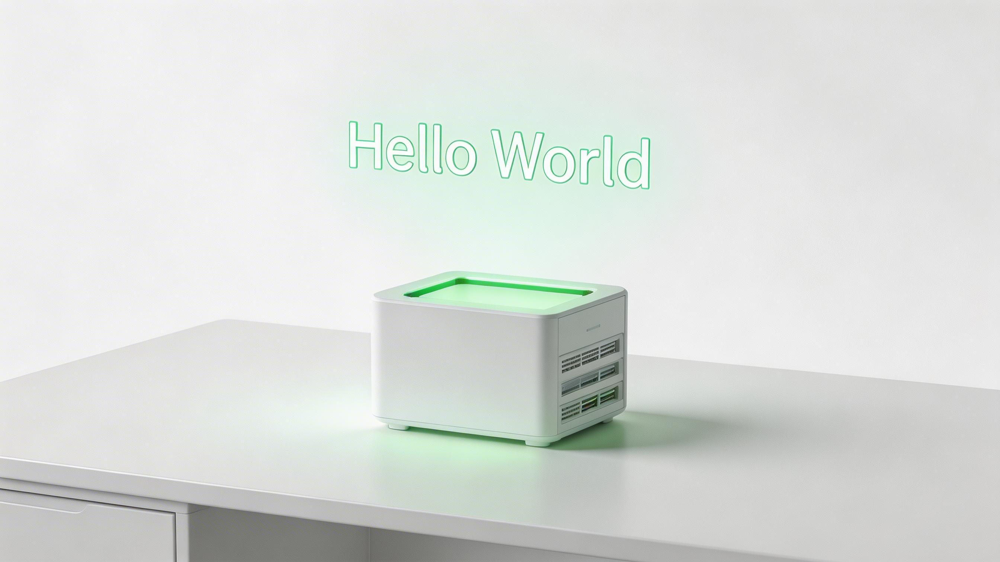

# 第 9 章　第一个 MCP 服务：Hello World



理论讲完了，现在我们来动手。
本章将带你编写一个最简单的 MCP Server。我们将实现一个名为 `weather-server` 的服务，它可以让 Claude Code 查询“当前的天气”。

虽然“查询天气”听起来很老套，但它涵盖了 MCP 开发的所有核心要素：工具定义、参数校验、API 调用以及与 Host 的交互。

## 9.1 技术选型：Python vs. TypeScript

MCP 官方 SDK 支持多种语言。在本书中，我们将主要使用 **TypeScript** (基于 `Node.js`)，因为它的类型系统能很好地映射 MCP 的 Schema，且生态中最活跃。
如果你是 Python 开发者，逻辑是完全一样的，只是语法稍有不同（可以参考附录中的 Python 示例）。

**准备工作**：
- Node.js >= 18
- npm 或 pnpm
- Claude Code 已安装并登录

---

## 9.2 初始化项目

首先，创建一个新的 Node.js 项目。

```bash
mkdir weather-server
cd weather-server
npm init -y
```

安装 MCP 官方 SDK：

```bash
npm install @modelcontextprotocol/sdk zod
```
*(注：`zod` 是一个非常好用的 schema 校验库，我们将用它来定义工具的参数)*

---

## 9.3 编写代码

在项目根目录下创建 `index.js`（为了简单，我们先用纯 JS，生产环境推荐 TS）。

```javascript
#!/usr/bin/env node

import { Server } from "@modelcontextprotocol/sdk/server/index.js";
import { StdioServerTransport } from "@modelcontextprotocol/sdk/server/stdio.js";
import { CallToolRequestSchema, ListToolsRequestSchema } from "@modelcontextprotocol/sdk/types.js";
import { z } from "zod";

// 1. 创建 Server 实例
const server = new Server(
  {
    name: "weather-server",
    version: "1.0.0",
  },
  {
    capabilities: {
      tools: {}, // 声明我们提供 Tools 能力
    },
  }
);

// 2. 定义工具列表
server.setRequestHandler(ListToolsRequestSchema, async () => {
  return {
    tools: [
      {
        name: "get_weather",
        description: "获取指定城市的当前天气信息",
        inputSchema: {
          type: "object",
          properties: {
            city: {
              type: "string",
              description: "城市名称，如 Beijing, Shanghai",
            },
          },
          required: ["city"],
        },
      },
    ],
  };
});

// 3. 实现工具逻辑
server.setRequestHandler(CallToolRequestSchema, async (request) => {
  if (request.params.name === "get_weather") {
    const city = request.params.arguments.city;
    
    // 模拟 API 调用（真实场景下你会在这里 fetch 气象局接口）
    // 为了演示，我们随机生成一点数据
    const mockTemps = {
      "Beijing": "25°C",
      "Shanghai": "28°C",
      "New York": "15°C"
    };
    
    const weather = mockTemps[city] || "Unknown (API Mock)";

    return {
      content: [
        {
          type: "text",
          text: `Current weather in ${city}: ${weather}`,
        },
      ],
    };
  }

  throw new Error("Tool not found");
});

// 4. 启动服务（通过 Stdio 通信）
const transport = new StdioServerTransport();
await server.connect(transport);
```

这段代码做了三件事：
1.  **初始化**：声明自己叫 `weather-server`。
2.  **声明工具**：告诉 Host “我会 `get_weather` 这个技能，你需要传给我 `city` 参数”。
3.  **实现逻辑**：当 Host 真的调用 `get_weather` 时，执行代码并返回结果。

---

## 9.4 注册到 Claude Code

写好了 Server，怎么让 Claude Code 知道它的存在呢？
你需要修改 Claude Code 的配置文件。

### 9.4.1 查找配置文件
运行以下命令找到配置文件的位置：
```bash
claude config --path
```
通常位于 `~/.claude/config.json` 或类似路径。

### 9.4.2 添加 Server 配置
打开配置文件，在 `mcpServers` 字段下添加你的服务：

```json
{
  "mcpServers": {
    "weather": {
      "command": "node",
      "args": ["/绝对路径/到/你的/weather-server/index.js"]
    }
  }
}
```
*注意：一定要使用绝对路径，确保 Claude 在任何目录下都能找到它。*

---

## 9.5 验证与测试

现在，见证奇迹的时刻到了。

1.  打开一个新的终端。
2.  输入 `claude` 进入交互模式。
3.  对它说：“北京今天天气怎么样？”

Claude Code 会经历以下心理活动：
1.  **思考**：用户问天气 -> 我自己不知道 -> 查一下我有啥工具 -> 发现 `weather` 服务有个 `get_weather` 工具 -> 它的描述是“获取天气” -> 匹配！
2.  **调用**：向 `weather-server` 发送 JSON RPC 请求：`call_tool("get_weather", { city: "Beijing" })`。
3.  **响应**：Server 返回 `25°C`。
4.  **回答**：Claude 综合信息，回答你：“北京今天天气不错，气温是 25°C。”

如果你看到了类似的回答，恭喜你！你已经成功扩展了 Claude Code 的能力边界。

---

## 9.6 进阶：调试 MCP Server

如果 Claude 报错说“无法连接 Server”怎么办？

### 9.6.1 使用 MCP Inspector
MCP 官方提供了一个基于 Web 的调试工具：`@modelcontextprotocol/inspector`。
你可以直接运行：
```bash
npx @modelcontextprotocol/inspector node index.js
```
它会启动一个网页，你在网页上可以看到 Server 暴露的所有工具，并可以手动点击按钮进行测试，就像用 Postman 测试 API 一样。

### 9.6.2 查看日志
由于 MCP Server 是通过 Stdio（标准输入输出）通信的，你不能直接用 `console.log` 打印日志（这会破坏协议格式）。
**解决方案**：使用 `console.error`。标准错误输出（Stderr）会被 Claude Code 捕获并记录在日志文件中，而不会干扰协议通信。

---

## 9.7 小结

本章我们用不到 50 行代码实现了一个“天气查询”服务。虽然简单，但它展示了 MCP 的核心魅力：
**定义 Schema -> 实现 Logic -> 注册 Config**。

只要遵循这个三步走流程，你可以把任何东西变成 MCP Server：
- 一个查询公司内部人员架构的 Server。
- 一个计算 AWS 实时成本的 Server。
- 一个控制办公室咖啡机的 Server（只要它有 API）。

在下一章，我们将不再满足于简单的“查询”，而是要深入企业级场景——如何连接复杂的数据库、处理认证，并让 Claude Code 真正融入你的业务流。
