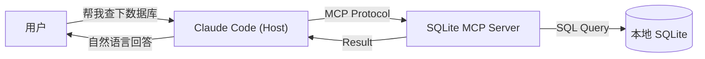

# 第 8 章　MCP 概念与设计思想：连接 AI 与世界的通用协议

在前面的章节中，我们把 Claude Code 当作一个“只懂代码”的助手：它能读文件、写文件、跑终端。这对于写代码来说已经很棒了。
但是，**真实世界的数据并不都躺在文件系统里**。

你的 Bug 单在 Jira 上，你的监控数据在 Prometheus 里，你的用户数据在 PostgreSQL 数据库中，你的部署状态在 Kubernetes 集群里。如果 Claude Code 只能读本地文件，那它就只是一个“跛脚”的工程师——每次都要你手动去查这些系统，然后复制粘贴给它。

**MCP (Model Context Protocol)** 就是为了解决这个问题而诞生的。它是一套开放标准，旨在让 AI 模型能够以安全、统一的方式连接到任何外部数据源和工具。

## 8.1 什么是 MCP？

用一句话解释：**MCP 是 AI 时代的 USB 协议。**

在过去，如果你想让 AI 连接数据库，你得写一段特定的代码；想连接 Slack，又得写另一段代码。这就像以前买鼠标要分 PS/2 接口、串口接口一样麻烦。
MCP 定义了一套通用的接口标准（Client-Host-Server），只要你的工具（如 Linear、GitHub、Postgres）实现了一个 MCP Server，任何支持 MCP 的 AI 客户端（如 Claude Code、Cursor、Zed）就都能直接使用它，而无需专门适配。

### 8.1.1 核心架构
MCP 体系包含三个角色：

1.  **MCP Host (宿主)**：发起请求的一方。
    - 在本书的语境下，**Claude Code 就是 Host**。它负责把用户的自然语言需求转化为对 MCP 工具的调用。

2.  **MCP Server (服务端)**：提供能力的一方。
    - 这是一个轻量级的服务，它不直接与用户对话，而是暴露两类东西：
        - **Resources (资源)**：类似文件的数据（如“今天的服务器日志”、“用户表的前10行”）。
        - **Tools (工具)**：可执行的函数（如“创建一个 Jira Ticket”、“重启 Pod”）。

3.  **MCP Client (客户端)**：
    - 连接 Host 和 Server 的桥梁（在 Claude Code 内部已内置）。

---

## 8.2 为什么 MCP 比“写个脚本”更好？

你可能会问：“如果我要查数据库，我直接让 Claude 写个 Python 脚本跑一下不就行了？为什么要搞这么复杂的协议？”

### 8.2.1 安全性 (Security)
- **脚本**：Claude 生成的脚本可能包含 `rm -rf` 或者把密钥打印出来。你每次运行都要心惊胆战地 Review。
- **MCP**：Server 是你预先部署好的，逻辑是固定的。你只暴露了 `query_users` 接口，Claude 就绝对无法执行 `drop_table`（除非你故意暴露了这个功能）。**权限控制在开发者手中，而不是 AI 手中。**

### 8.2.2 上下文保持 (Context)
- **脚本**：是一次性的。跑完就没了，下一次对话又要重新生成。
- **MCP**：Server 是常驻的。Claude 可以持续通过 `Resources` 订阅数据变化。例如，你可以让 Claude 监控日志文件的尾部，一旦出现 Error 就报警。

### 8.2.3 复用性 (Reusability)
- **脚本**：通常只针对当前问题。
- **MCP**：一旦你写好了 `Jira MCP Server`，全团队的人、所有的 AI 客户端（不仅是 Claude Code）都可以直接复用。

---

## 8.3 MCP 的三大支柱：Resources, Prompts, Tools

在开发 MCP Server 时，你需要关注这三个核心概念：

### 8.3.1 Resources (资源)
**“给 AI 看的数据。”**
资源是只读的。它们可以是文件、数据库记录、API 返回的 JSON。
- 例子：`postgres://users/123`
- AI 行为：`read_resource(uri)`

### 8.3.2 Tools (工具)
**“让 AI 做的事情。”**
工具是可执行的函数，通常会有副作用（修改数据）。
- 例子：`create_issue(title, description)`
- AI 行为：`call_tool(name, arguments)`

### 8.3.3 Prompts (提示词模板)
**“教 AI 怎么用。”**
Server 可以内置一些 Prompt 模板，告诉 Host 如何更好地使用自己提供的资源和工具。
- 例子：`explain-query-plan`（当用户问查询性能时，自动调用此模板）。

---

## 8.4 小结

MCP 不是什么黑科技，它只是把“AI 调用外部工具”这件事标准化了。
- 它让 AI 从“文件系统的囚徒”变成了“数字世界的游侠”。
- 它通过标准协议解决了安全性、复用性和上下文问题。

在下一章，我们将不动嘴皮子，直接动手写代码——**从零开发你的第一个 MCP Server**。无论你是用 Python 还是 TypeScript，只要 10 分钟，你就能让 Claude Code 拥有“超能力”。
