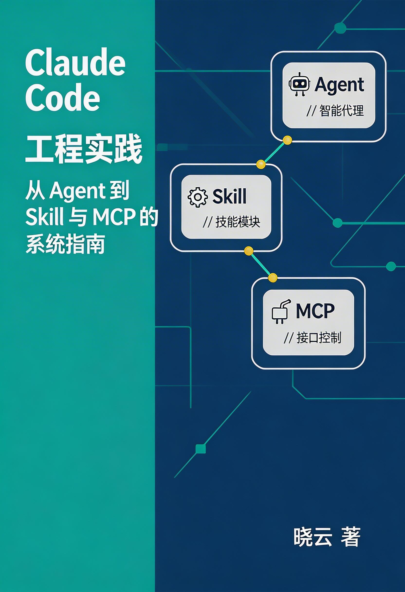
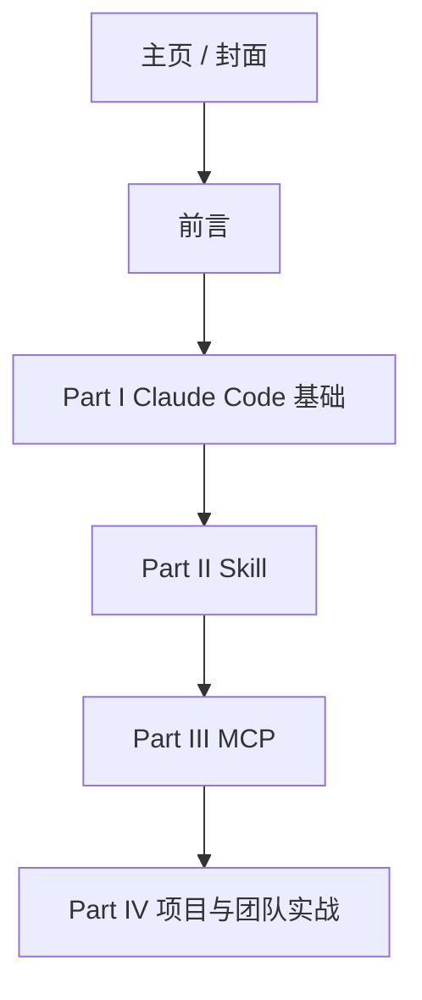

  

# Claude Code 工程实践

让 Claude Code 真正接入你的工程世界，而不只是在聊天窗口里“写几行代码”。

<strong>副标题</strong>：从 Agent 到 Skill 与 MCP 的系统指南

<strong>版本</strong>：0.1.0‑draft（预览版）

<strong>作者</strong>：晓云

  

  

    
  

本页面相当于本书的“封面页”和元信息页，你可以从这里快速了解本书的结构，并进入相应章节阅读。

## 图书信息一览

- **主题**：Claude Code 在真实工程环境中的系统实践  
- **三条主线**：Claude Code 本体、Skill 体系、MCP 集成  
- **目标读者**：有实际项目经验的工程师与技术负责人  
- **关键词**：Claude Code、Skill、MCP、AI 编程、工程实践

## 快速入口

- **前言**：点击这里进入 [前言](/00-preface/)  
- **Claude Code 基础**：点击这里进入 [Claude Code 概览](/10-claude-code/intro)  
- **Skill 入门**：点击这里进入 [Skill 入门](/20-skill/intro)  
- **MCP 入门**：点击这里进入 [MCP 入门](/30-mcp/intro)

## 章节结构示意

后续内容会在这些章节中逐步完善，你也可以通过右上角的搜索框按关键词检索想看的主题。

